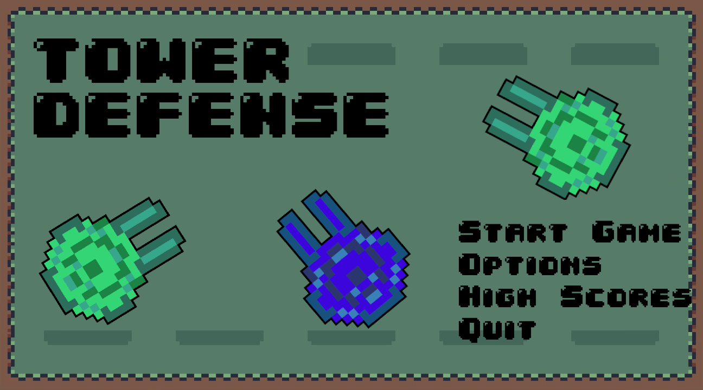
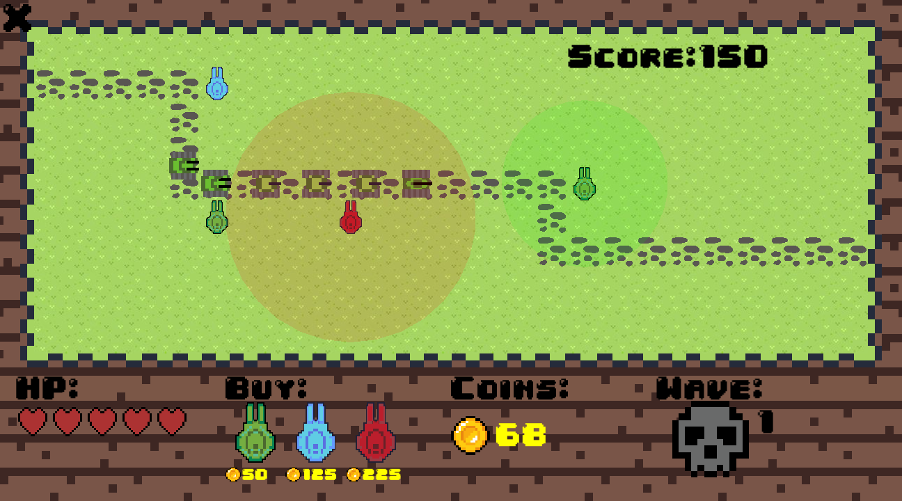
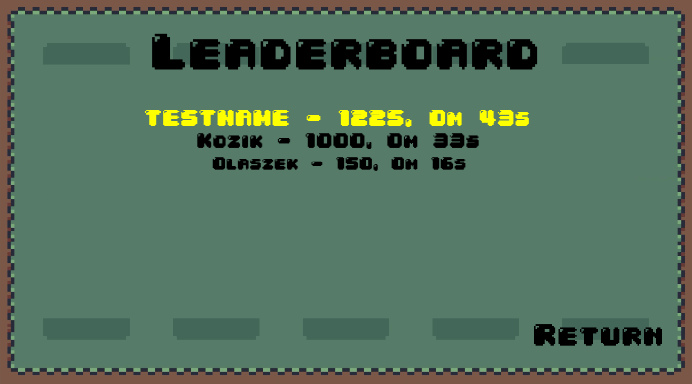

# Tower Defense Game (C++ / SFML)

This is a simple Tower Defense game developed using C++ and the SFML for graphics, window management, and event handling. The goal of the game is to prevent waves of enemies from reaching your base by strategically placing towers along their path.

## Features

- **Strategic Gameplay**: Place towers along predefined paths to stop incoming waves of enemies.
- **Multiple Tower Types**: Different towers with different statistics such as shooting fast or dealing more damage.
- **Enemy Waves**: Enemies of various types and strengths that increase as you progress.
- **Game Over & Win Conditions**: The game ends when enemies reach the base.
- **Simple Graphics & Sound**: Basic 2D graphics using SFML and sound effects.

## Screenshots

### Main Menu

This is the game's main menu, where players can start a new game, access the leaderboard, or adjust settings.

### Gameplay Info

This screenshot shows the in-game scene during active play, displaying the game environment, towers, and enemies.
1. **HP**: The player's current health points.
2. **Buy**: The tower purchase menu. Each tower has its price in gold coins.
3. **Coins**: The current amount of coins the player has.
4. **Wave**: The number of the current enemy wave and the button to start the next wave of enemies.
5. **Score**: The player's current score.
6. **Return Button**: A button to return to the main menu.
7. **Defense Towers**: The player can place towers on the map in allowed areas.
8. **Enemies**: Enemies moving along the designated path.

### Gameplay

Here, you can see the gameplay in action, with the player placing towers and defending against enemy waves.

### Leaderboard

This is the leaderboard screen where players can view their high scores and compare their performance.
